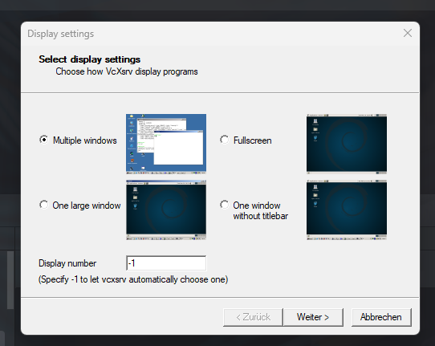
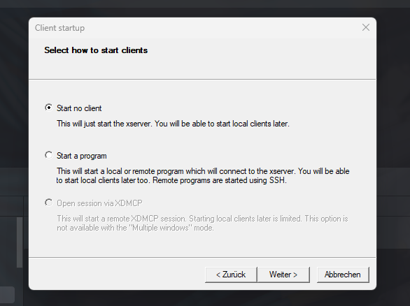
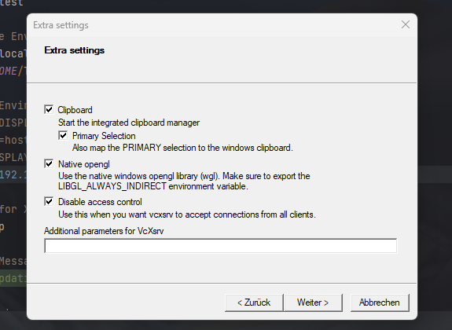
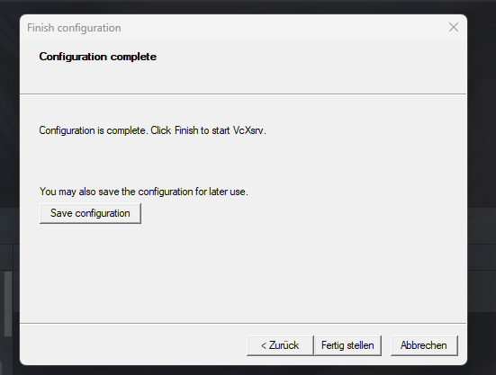

# TeamSpeak in a Nutshell

## Installation (Windows)
1.  Install VCXSRV (For using X11 Client) <br>
    ```choco install vcxsrv```<br><br>
2. 
3. 
4. 
5. 
6. Save Configuration to ``%appdata%\Xming`` or ``%userprofile%`` as config.xlaunch!
7. Build Dockerfile ``docker build -t teamspeak5nutshell .`` 
8. Set Display Variable (or direct input Host String) ``set-variable -name DISPLAY -value host.docker.internal:0.0``
9. Run Container with ``docker run -ti --rm -e DISPLAY=$DISPLAY teamspeak5nutshell:latest``